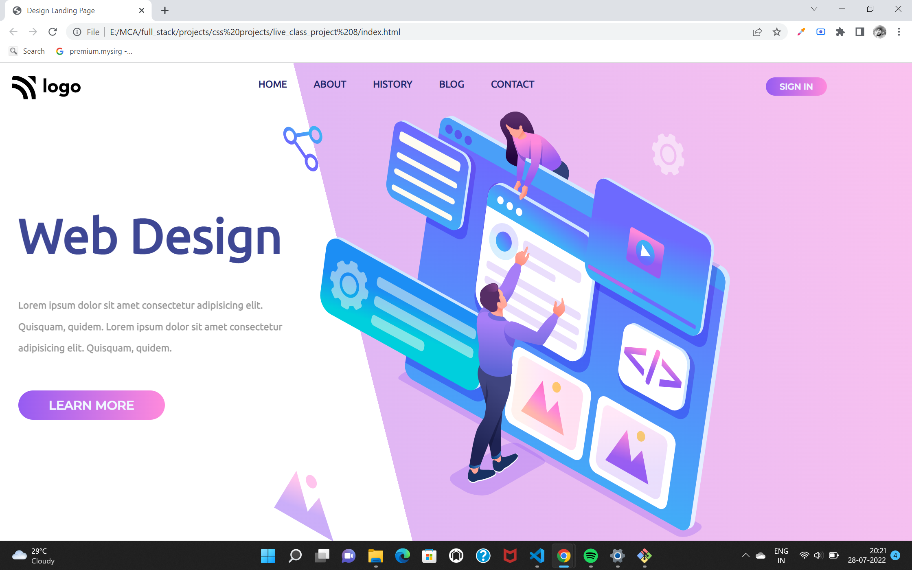

# welcome to Rohan Kaushik's project

wow feeling happy after doing this project because this project taught me alot....

## What I have learnt in this Project
   - as you are seeing the half pink color background and half white with some angle this i have explored how to  do that effect
   - for this background you have to use th linear-gradient property of css which allows you to have backgroung of different colours and different angles 

## Time Spent on this project

- This project tooks my 3 hrs ...

